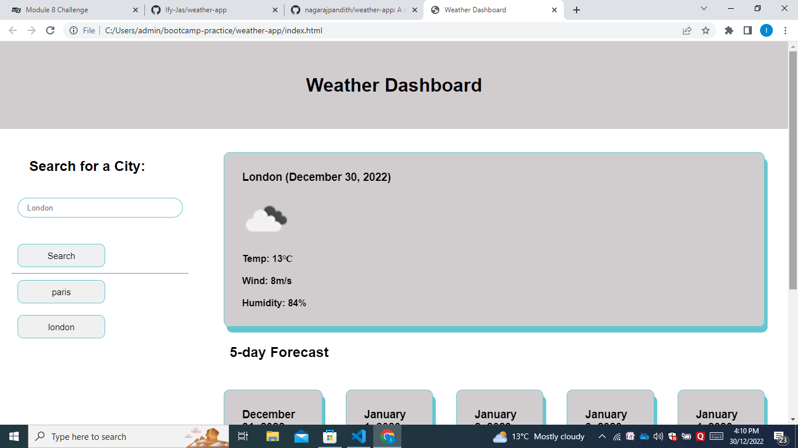
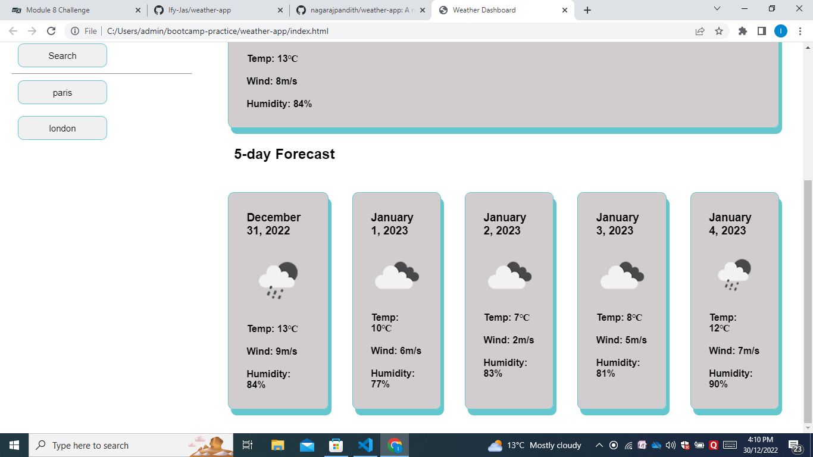

# weather-app

This is a coding challenge testing us to build a 5-day weather forecast app.

Link to deployed webpage: https://ify-jas.github.io/weather-app/

This week's challenge was to create a 5day weather app using jQuery. This allowed me to use all that we have learnt this week about server APIs and also incorporate my knowledge of previous topics including  functions, jQuery, moment.js, and a bit of loop. 
Find screenshots to the weather app below;

I found this particular challenge interesting as it allowed me to make use of my increasingly wide range of coding skills. I was able to make use of the DOM to target get the required values. I was also able to store values to local storage and call them to be inserted into the HTML.

## Installation

1. Openweather API
2. Moment.js
3. JQuery

## License

Please refer to the License in the repository.